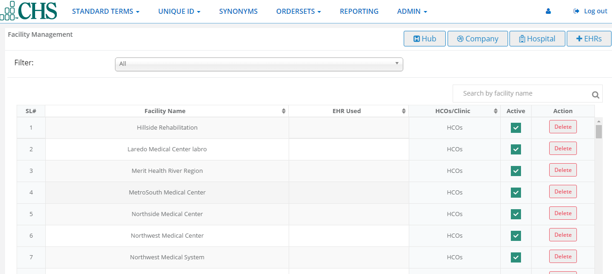
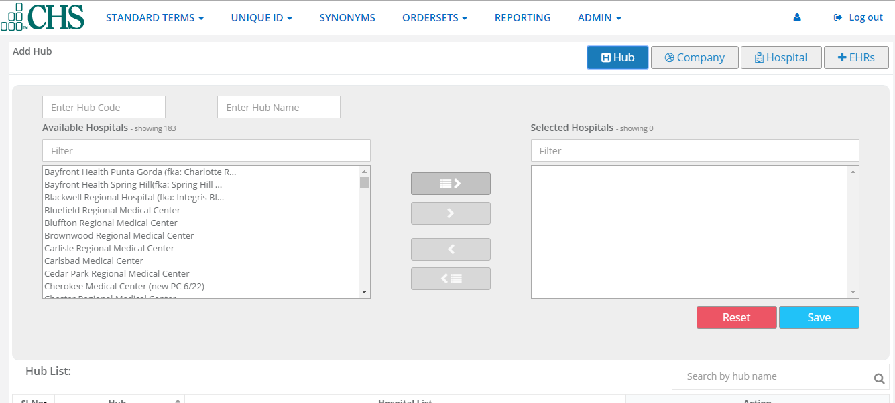
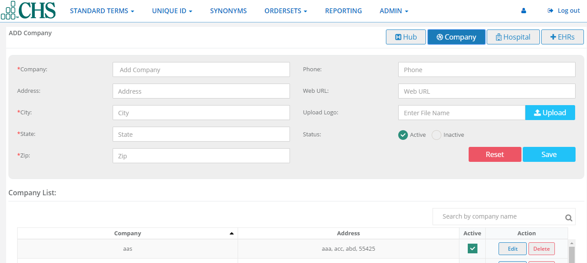
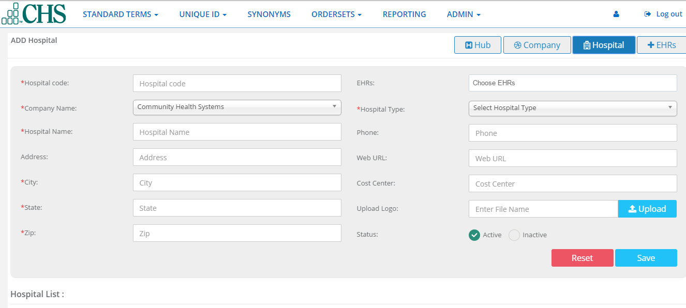
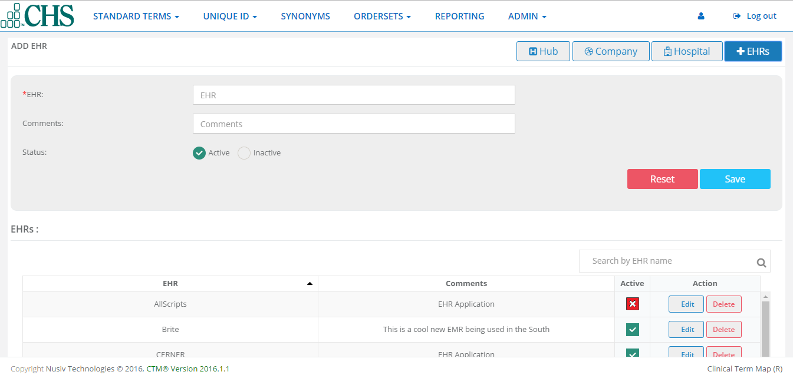

Facilities
==========
Facilities allows the admin to add and manage Hubs, Companies(Corporate Healthcare Entities), Hospitals(Facilities) and EHRs(Electronic Health Record applications). You can delete, activate and inactivate companies, hospitals and EHRs.

Hub
^^^

Company
^^^^^^^
1.Click on company.

2.Type company information.

3.Add the company's logo by clicking the upload button, browsing for the picture file and click the upload button.

4.Check a status of Active or Inactive and click save.The new company will appear in the companies list where you can also Edit, Delete, Active or Inactive.

Hospital
^^^^^^^^
1.Click on Hospital button.

2.Type in hospital information.

3.You can add the company's logo by clicking the upload button, browsing for the picture file and click upload button.

4.Check a status of Active or Inactive and click Save.The new hospital will appear in the facilities list where you can also EDIT, DELETE, Active, or Inactive

EHRs
^^^^
1.Click on EHRs button.

2.Type in EHR information.

3.Check a status of Active or Inactive and click save.The new EHR will appear in the EHRs list where you can also Edit, DElete,Active,or Inactive.

