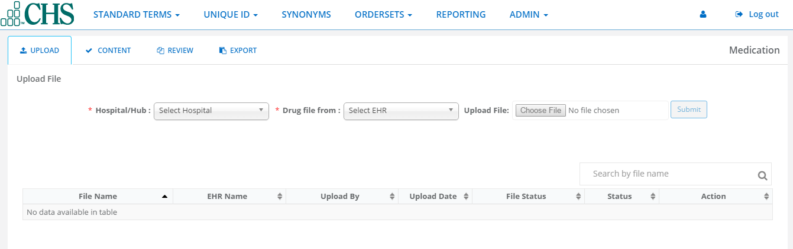
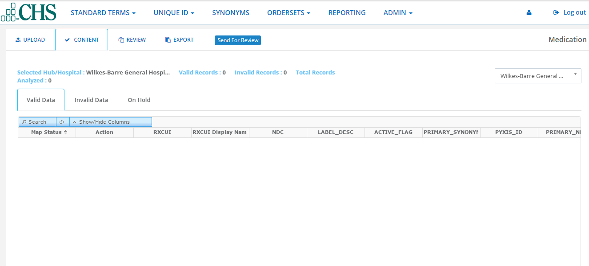
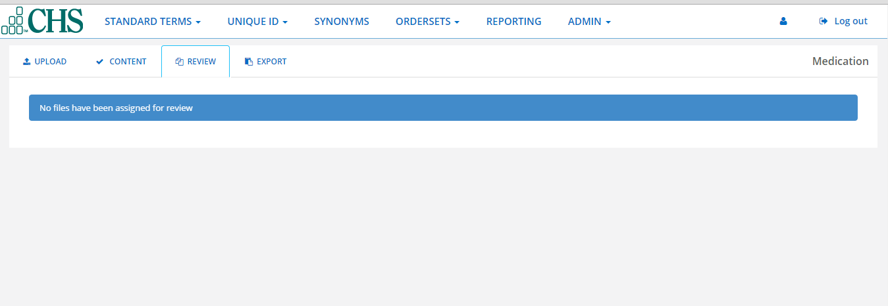
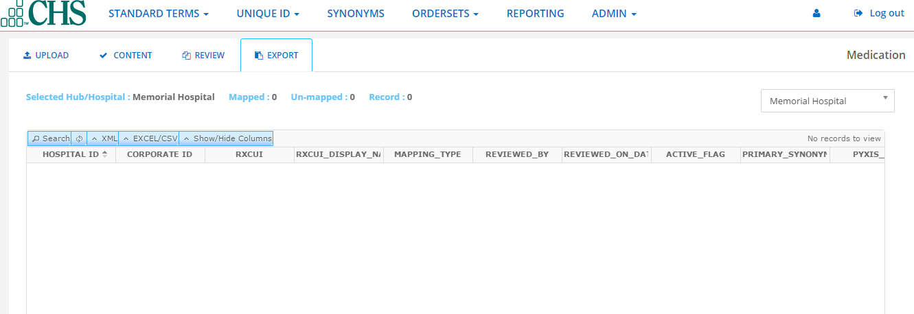

Medication
==========
The **Medications** feature allows the admin to:

.. toctree:: 
   :maxdepth: 2

1. **Upload File** - upload files from a hospital or client EHR system that can be processed to provide valid and invalid medications.

.. toctree::
   :maxdepth: 2

2. **Content Dashboard** - view Valid,invalid and On Hold RXCUI(Prescriptiion User Interface)data and send to the pharmacist for review.

.. toctree::
   :maxdepth: 2

3. **Review Management** - List files that have been assigned for review and their status.

.. toctree::
   :maxdepth: 2

4. **Export File** - export medication records to an Excel file,or into text CSV(Comma Separated Values).

.. toctree::
   :maxdepth: 2

Upload File
^^^^^^^^^^^
**Upload File** is a three-steps process for uploading,processing and completing review management of medication files.

.. toctree::
   :maxdepth: 4

1. Select hospital,and the EHR the drug file will come from,browse for the file,and click **Submit**:

.. toctree::
   :maxdepth: 

Contents
^^^^^^^^
**Content** is a user interface which allows the pharmacist/provider to verify if medication content is valod or invalid.

.. toctree::
   :maxdepth: 3

1.Click **Content Dashboard**.You will see the file that you had chosen,the **Total Records Analyzed**,and three(3) tabs:

.. toctree::
   :maxdepth: 4

* **Valid Data** - the hospital NDC matches RXNorm NDC.
* **Invalid Data** - the hospital NDC does not match RXNorm NDC or the hospital NDC obsolete.
* **On Hold** - a particular medication is under review and reviewer  has kept medication on hold for future update.

.. toctree::
   :maxdepth: 4

Valid Data
..........

**Valid Data** displays all the medications that were algorithmically matched with the RXNorm NDC.

Invalid Data
............
**Invalid Data** displays all the medications that have been not validated.

On Hold
.......
**On Hold** is an indicator that a medications being reviewed.

Review
^^^^^^
Reviewers across the system use **Review** to response to the mail message communications from other providers

Export
^^^^^^

   
